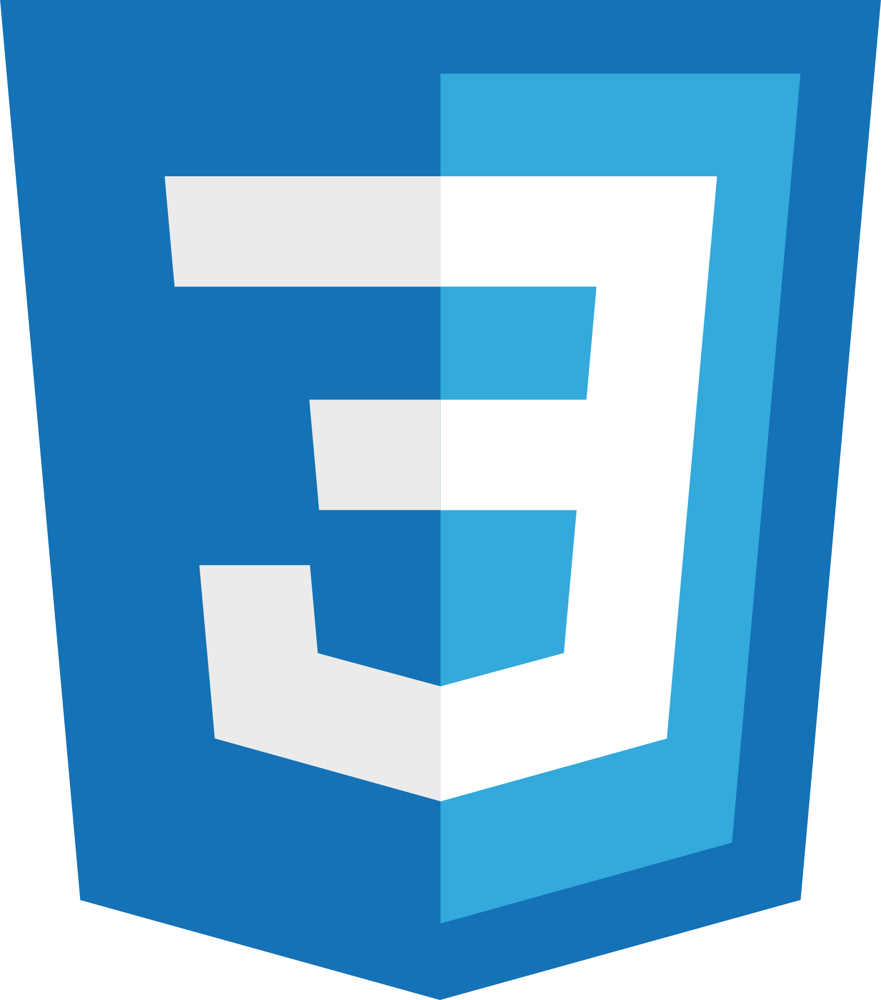
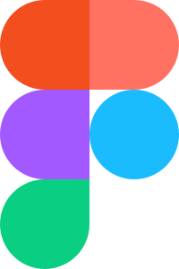

# Alan Fedrizzi

  <a href="https://www.linkedin.com/in/alan-fedrizzi-ba0b89b7/" target="_blank"><a>
  
 

### Currently studying:

  
  
  
  
  
  

### Design Tools

    

## Courses

Currently doing.

- **[The Complete JavaScript Course 2022: From Zero to Expert!](https://www.udemy.com/course/the-complete-javascript-course/)** by **[Jonas Schmedtmann](https://www.udemy.com/user/jonasschmedtmann/)** on **[Udemy](https://www.udemy.com/)**.

A list of courses I took.

- **[Advanced CSS and Sass](https://www.udemy.com/course/advanced-css-and-sass/)** by **[Jonas Schmedtmann](https://www.udemy.com/user/jonasschmedtmann/)** on **[Udemy](https://www.udemy.com/)**.
- **[Online Course Build Responsive Real-World Websites with HTML and CSS](https://www.udemy.com/course/design-and-develop-a-killer-website-with-html5-and-css3/)** by **[Jonas Schmedtmann](https://www.udemy.com/user/jonasschmedtmann/)** on **[Udemy](https://www.udemy.com/)**.

## Projects

A list of personal and course projects.

### Personal Projects

- **[Spatium](https://github.com/Alan-Fedrizzi/spatium)** - Recreation od a layout from Figma.
- **[Widgets](https://github.com/Alan-Fedrizzi/widgets)** - A compilation of Widgets for practice.

### Course Projects

- **[Omnifood](https://github.com/Alan-Fedrizzi/omnifood)** - Project developed in the **Course Build Responsive Real-World Websites with HTML and CSS** (Udemy).
- **[Natours](https://github.com/Alan-Fedrizzi/natours)** - Project developed in the course **Advanced CSS and Sass** (Udemy).
- **[Trillo](https://github.com/Alan-Fedrizzi/trillo)** - Project developed in the course **Advanced CSS and Sass** (Udemy).
- **[Nexter](https://github.com/Alan-Fedrizzi/nexter)** - Project developed in the course **Advanced CSS and Sass** (Udemy).
