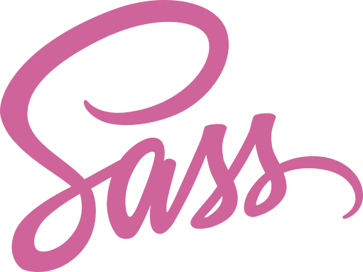
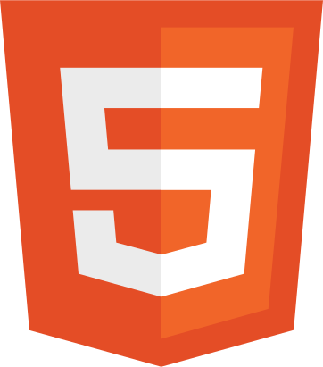
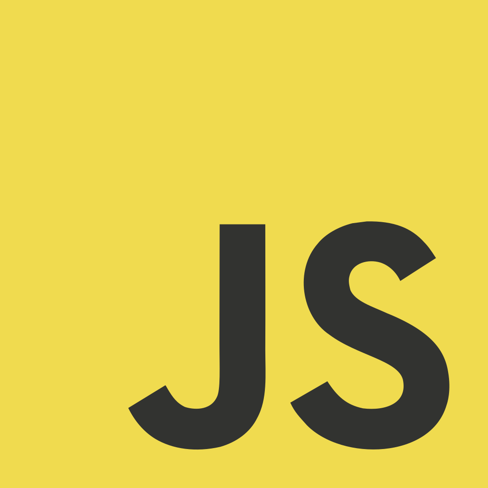

# Alan Fedrizzi

  <a href="https://www.linkedin.com/in/alan-fedrizzi-ba0b89b7/" target="_blank"><a>
  
 

### Currently studying:

  
  
  
  
  
  
  
  
  
  
  
  
  
  
  
  

### Design Tools

    

## Courses

Currently doing:

A list of courses I took:

- **[Advanced CSS and Sass](https://www.udemy.com/course/advanced-css-and-sass/)** by **[Jonas Schmedtmann](https://www.udemy.com/user/jonasschmedtmann/)** on **[Udemy](https://www.udemy.com/)**.
- **[Online Course Build Responsive Real-World Websites with HTML and CSS](https://www.udemy.com/course/design-and-develop-a-killer-website-with-html5-and-css3/)** by **[Jonas Schmedtmann](https://www.udemy.com/user/jonasschmedtmann/)** on **[Udemy](https://www.udemy.com/)**.
- **[The Complete JavaScript Course 2022: From Zero to Expert!](https://www.udemy.com/course/the-complete-javascript-course/)** by **[Jonas Schmedtmann](https://www.udemy.com/user/jonasschmedtmann/)** on **[Udemy](https://www.udemy.com/)**.
- **[Understanding TypeScript](https://www.udemy.com/course/understanding-typescript/)** by **[Maximilian Schwarzmüller](https://www.udemy.com/user/maximilian-schwarzmuller/)** on **[Udemy](https://www.udemy.com/)**.
- **[Web Components & Stencil.js - Build Custom HTML Elements](https://www.udemy.com/course/web-components-stenciljs-build-custom-html-elements/)** by **[Maximilian Schwarzmüller](https://www.udemy.com/user/maximilian-schwarzmuller/)** on **[Udemy](https://www.udemy.com/)**.
- **[Ionic - Build iOS, Android & Web Apps with Ionic & Angular](https://www.udemy.com/course/ionic-2-the-practical-guide-to-building-ios-android-apps/)** by **[Maximilian Schwarzmüller](https://www.udemy.com/user/maximilian-schwarzmuller/)** on **[Udemy](https://www.udemy.com/)**.
- **[Master JavaScript Animations with Greensock](https://www.udemy.com/course/master-javascript-animations-with-greensock/)** by **[Enzo Ustariz](https://www.udemy.com/user/ustariz-enzo/)** on **[Udemy](https://www.udemy.com/)**.
- **[GreenSock 101](https://ihatetomatoes.net/get-greensock-101/)** by **Petr Tichy** on **[I Hate Tomatoes](https://ihatetomatoes.net/)**.
- **[Barba.js 101](https://ihatetomatoes.net/get-barba-101/)** by **Petr Tichy** on **[I Hate Tomatoes](https://ihatetomatoes.net/)**.
- **[React Native](https://www.rocketseat.com.br/formacao/react-native)** (ongoing) by **[RocketSeat](https://www.rocketseat.com.br/)**.
- **[NLW 15 Unite React-Native](https://app.rocketseat.com.br/classroom/nlw-15-unite-react-native)** by **[RocketSeat](https://www.rocketseat.com.br/)**.

## Projects

A list of personal and course projects.

### Personal Projects

- **[Spatium](https://github.com/Alan-Fedrizzi/spatium)** - Recreation of a layout from Figma.
- **[Widgets](https://github.com/Alan-Fedrizzi/widgets)** - A compilation of Widgets for practice.
- **[Medgrupo](https://prova-1-medgrupo.netlify.app/)** - Project developed for the **Medgrupo selection process**.
- Practice - Project built as an exercise during the selection process at Medgrupo:
  - **[Exercise 1](https://practice-medgrupo.netlify.app/exercicio-1/)**
  - **[Exercise 2](https://exercise-storybook.netlify.app/?path=/story/components-badge--default)**
  - **[Exercise 3](https://practice-medgrupo.netlify.app/exercicio-3/)**
  - **[Exercise 4](https://practice-medgrupo.netlify.app/exercicio-4/)**
  - **[Exercise 5](https://practice-medgrupo.netlify.app/exercicio-5/)**
  - **[Exercise 6](https://practice-medgrupo.netlify.app/exercicio-6/)**
- **[tic-tac-toe](https://github.com/Alan-Fedrizzi/tic-tac-toe)**
- **[A simple calculator](https://github.com/Alan-Fedrizzi/aff-calc)**

### Course Projects

- **[Omnifood](https://github.com/Alan-Fedrizzi/omnifood)** - Project developed in the course **Responsive Real-World Websites with HTML and CSS** (Udemy).
- **[Natours](https://github.com/Alan-Fedrizzi/natours)** - Project developed in the course **Advanced CSS and Sass** (Udemy).
- **[Trillo](https://github.com/Alan-Fedrizzi/trillo)** - Project developed in the course **Advanced CSS and Sass** (Udemy).
- **[Nexter](https://github.com/Alan-Fedrizzi/nexter)** - Project developed in the course **Advanced CSS and Sass** (Udemy).
- **[Guess My Number](https://github.com/Alan-Fedrizzi/guess-my-number)** - Project developed in the course **The Complete JavaScript Course 2022: From Zero to Expert** (Udemy).
- **[Modal](https://github.com/Alan-Fedrizzi/modal)** - Project developed in the course **The Complete JavaScript Course 2022: From Zero to Expert** (Udemy).
- **[Pig Game](https://github.com/Alan-Fedrizzi/pig-game)** - Project developed in the course **The Complete JavaScript Course 2022: From Zero to Expert** (Udemy).
- **[Bankist App](https://github.com/Alan-Fedrizzi/bankist-app)** - Project developed in the course **The Complete JavaScript Course 2022: From Zero to Expert** (Udemy).
- **[Bankist Site](https://github.com/Alan-Fedrizzi/bankist-site)** - Project developed in the course **The Complete JavaScript Course 2022: From Zero to Expert** (Udemy).
- **[Where Am I](https://github.com/Alan-Fedrizzi/where-am-i)** - Project developed in the course **The Complete JavaScript Course 2022: From Zero to Expert** (Udemy).
- **[Mapty](https://github.com/Alan-Fedrizzi/mapty)** - Project developed in the course **The Complete JavaScript Course 2022: From Zero to Expert** (Udemy).
- **[forkify](https://github.com/Alan-Fedrizzi/forkify)** - Project developed in the course **The Complete JavaScript Course 2022: From Zero to Expert** (Udemy).
- **[drag-drop](https://github.com/Alan-Fedrizzi/drag-drop)** - Project developed in the course **Understanding TypeScript** (Udemy).
- **[node-express](https://github.com/Alan-Fedrizzi/node-express)** - Project developed in the course **Understanding TypeScript** (Udemy).
- **[modal-component](https://github.com/Alan-Fedrizzi/modal-component)** - Project developed in the course **Web Components & Stencil.js - Build Custom HTML Elements** (Udemy).
- **[web-components-stencil](https://github.com/Alan-Fedrizzi/web-components-stencil)** - Project developed in the course **Web Components & Stencil.js - Build Custom HTML Elements** (Udemy).
- **[ng-refresher-ionic](https://github.com/Alan-Fedrizzi/ng-refresher-ionic)** - Project developed in the course **Ionic - Build iOS, Android & Web Apps with Ionic & Angular** (Udemy).
- **ionic-angular-course** - Project developed in the course **Ionic - Build iOS, Android & Web Apps with Ionic & Angular** (Udemy).
- **[gsap-animations](https://github.com/Alan-Fedrizzi/gsap-animations)** - Project developed in the course **Master JavaScript Animations with Greensock** (Udemy).
- **[GreenSock 101](https://github.com/Alan-Fedrizzi/greensock-101)** - Project developed in the course **GreenSock 101** (I Hate Tomatoes).
- **[Barba.js 101](https://github.com/Alan-Fedrizzi/barbajs-101)** - Project developed in the course **Barba.js 101** (I Hate Tomatoes).
- **[Comprar](https://github.com/Alan-Fedrizzi/comprar)** - Project developed in the course **React-Native** (RocketSeat).
- **[NLW 15 Unite React-Native](https://github.com/Alan-Fedrizzi/unite)** - Project developed in the course **NLW 15 Unite React-Native** (RocketSeat).
